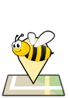

# Beefinder

BeeFinder (primary name; sometimes BeeFindr if BeeFinder is not available) connects beekeepers with wild or escaped hives. 

## Overview
* Continuous integration and delivery with TravisCI   https://travis-ci.org/openscript/beefindr
* Backend with Firebase   https://console.firebase.google.com/project/beefindr
* Hosting with Firebase   https://beefindr.firebaseapp.com/
  * Hello World proof of concept: https://beefindr.firebaseapp.com/hello-world
* Code quality with CodeClimate   https://codeclimate.com/github/openscript/beefindr
* Test Coverage with CodeClimate   https://codeclimate.com/github/openscript/beefindr

## Contribute
* Write commit messages in English and follow https://chris.beams.io/posts/git-commit/

### Getting started
1. Install [git](https://git-scm.com/) and configure your user and email
1. Clone project   `git clone git@github.com:openscript/beefindr.git`
1. Set up development environment
   * Install [Visual Studio Code](https://code.visualstudio.com/)
   * Install [NodeJS](https://nodejs.org/en/) and [Yarn](https://yarnpkg.com/en/docs/install)
   * Install Angular CLI globaly   `yarn global add @angular/cli`
1. Change to the workspace   for example with `cd`
1. Install dependencies   `yarn install`
1. Run application and open browser   `ng serve --open`

### Add a feature
1. Clone or pull project   `git clone git@github.com:openscript/beefindr.git` or `git pull`
1. Create a new branch   `git checkout -b features/`**[yourFeature]**
1. Run tests   `ng test --code-coverage`
1. Push new branch to remote   `git push --set-upstream origin features/`**[yourFeature]**
1. Follow the `Add a pull request` instructions

### Add a pull request
1. Finish development of your feature
   * Make sure the tests are passing with `ng test --code-coverage`
1. Merge any commit from the master into the feature branch   `git merge master`
1. [Create a pull request](https://github.com/openscript/beefindr/pulls)
   * Select a reviewer
   * Make sure the checks are passing
   * Make sure the branch is mergable

## Glossary
The following terms should be used throughout.

Term | Definition
---- | ----------
beehive |  Man made enclosure to keep bees. In this project it's also used for wild bee colonies.
beekeeper | A person who works with bees.

## Ressources
* [[Tutorial] AngularFire2: Installation and Setup](https://github.com/angular/angularfire2/blob/master/docs/install-and-setup.md)
* [[Tutorial] Angular 7: Firebase Authentication](https://www.positronx.io/full-angular-7-firebase-authentication-system/)
* [[Media] Bee for the logo](https://openclipart.org/detail/221154/cartoon-bee)
* [[Media] Map for the logo](https://openclipart.org/detail/177208/map-location)
* [[Tutorial] Material UI: Getting started](https://material.angular.io/guide/getting-started)
